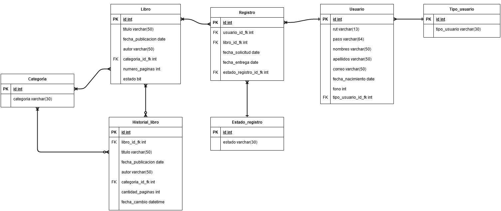

# biblioteca_generica
## Proyecto Final BD

**Integrantes:** 

Diego Marchant | Juan Reyes
-------------- | -----------

**Descripción del proyecto**

Se ha encargado a nuestro equipo la creación de un software para llevar a cabo las operaciones de una biblioteca
entre esas operaciones se encuentra:
-Tener 2 tipos de usuario (administrador y usuario común)
-Registrar un usuario (si es que no se encuentra)
-Un menú para el administrador en el cuál podrá:

    -Revisar los libros en el sistema.
	-Agregar libros,
	-Editar alguno de los datos de un libro
	-Eliminar un libro.
    -Revisar los registros de los usuarios
	-Aceptar la petición de solicitud hecha por un usuario
	-Aceptar la entrega del libro
	-Mostrar los datos de cada uno en una ventana a parte

-Un menú de Usuario en el que se pueda:

    -Filtrar los libros.
    -Actualizar sus datos (telefono y correo).
    -Solicitar libros en el sistema.

**Modelo E-R de la Base de datos**

**Cómo ejecutar el proyecto**

Para ejecutar el programa es necesario tener :

	-la vesion 1.8.0 de Java 
	-MariaDB instalado en el sistema

Despues de tener lo antes mencionado debemos dirigirnos a la carpeta sql 
y copiar el contenido del archivo Biblioteca_BD.sql(esto se puede hacer con
cualquier editor de texto) y copiarlo en la consola de mariadb.
Para finalizar debemos ir a la carpeta out/artifacts/Biblioteca_Generica_jar 
y darle doble click al archivo .jar
